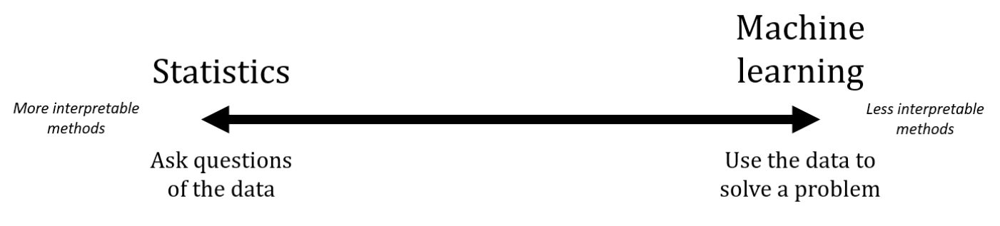
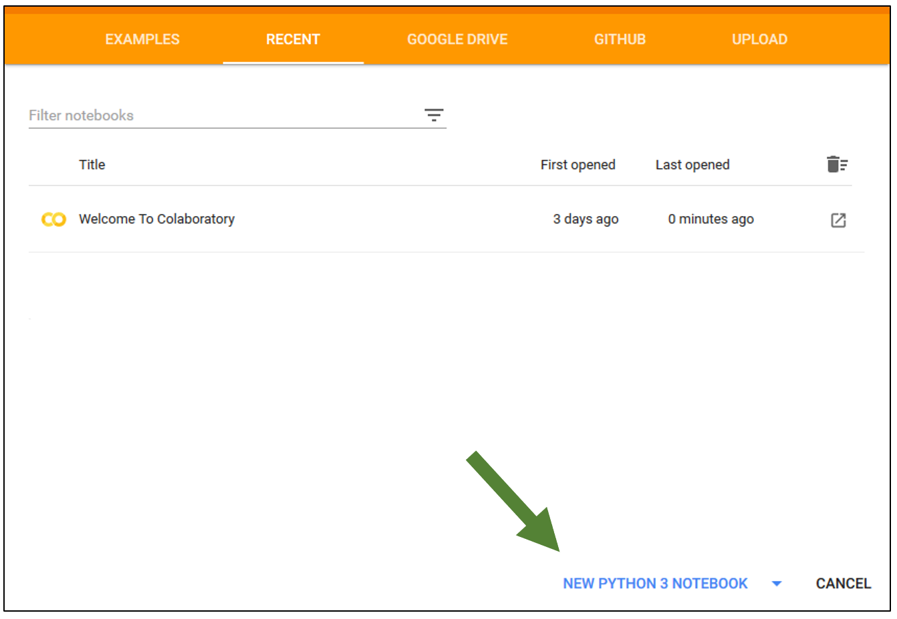
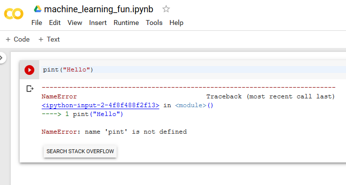

### What is machine learning?

Machine learning is broadly **using patterns in data to achieve a goal**. The goal can be pretty diverse, but the most common is the task of prediction. You have a set of data with measured properties of multiple types, and some new data for which you don't know the type. You would like to predict the type using the measured properties. This is known as **supervised learning**. It is supervised because you have known **labels** (the types) for the different data items. **Unsupervised learning** is the different case where you don't have particular labels. A classic unsupervised task is to find out how many different types of samples. Today, we will focus on a supervised task.

#### Machine learning versus statistics

How is machine learning related to statistics? They sometimes use similar methods so they seem to be related. Very broadly, statistics is asking questions about the data and using more interpretable methods in order to make conclusions about the data. Machine learning is using the data to achieve another goal, e.g. for predicting new data. Each statistics or machine learning method falls somewhere on the continuum below. Many machine learning methods are very difficult to interpret but can achieve goals that are unattainable by statistical methods.

> ### Where does deep learning fit into this?
> Deep learning has become well-known for great success in interpreting images, speech data and many other types of data. Deep learning is a machine learning method that falls on the far right of the statistics versus machine learning continuum. The methods try to emulate a simplified model of how our neurons fire and send signals to each other. While the methods can achieve incredible performance in many complicated tasks (e.g. describing an image with text), they are incredibly hard to interpret.
{: .callout}

> ### How about artificial intelligence?
> Today, machine learning and artificial intelligence are know used for the same methods. Artificial intelligence used to mean the idea of creating a computer that appeared to be alive, e.g. Bender from Futurama or Data from Star Trek. That is now know as artificial general intelligence.
{: .callout}

### Google Colab

We will use Google Colab for this workshop. It is an online notebook which can run Python code and is like Jupyter Notebook, but completely online. If you have a Google account, you can access it at <https://colab.research.google.com>.

Let's get started with it and create a new notebook. Select New Python 3 notebook from the Welcome page, or select File -> "New Python 3 notebook"

Then rename it at the top and give it a memorable name.

To get back to this notebook later, you can find it in the "Colab Notebooks" directory in your Google Drive at <https://drive.google.com>.

### Hello World

Let's write a single Python command and then run it.

You can click on the empty cell and add in the print command below.

~~~
print("Hello")
~~~
{: .language-python}

To run that cell, press Ctrl and Enter together, or select Runtime -> Run the focused cell or press the Play button on the left of the cell.

The output from running the code in the cell is shown below the cell.

### Errors

Let's see what an error looks like and introduce a typo.

~~~
pint("Hello")
~~~
{: .language-python}

When we run the cell again (Ctrl+Enter), the error message appears below and can help us diagnose the problem.

### Scikit-Learn

We are going to use the versatile [scikit-learn Python library](https://scikit-learn.org). It has a large number of machine learning methods already implemented with a lot of helper tools to work with data. It is already installed on Google Colab and comes with Anaconda. For other Python installations, it needs to be installed separately.

For other libraries, we used a single import statement. For example, for numpy we used the line below:

~~~
import numpy
~~~
{: .language-python}

For scikit-learn, we are going to do a from/import to select just the bits of scikit-learn that we need. The from/import code will be provided throughout this lesson.
